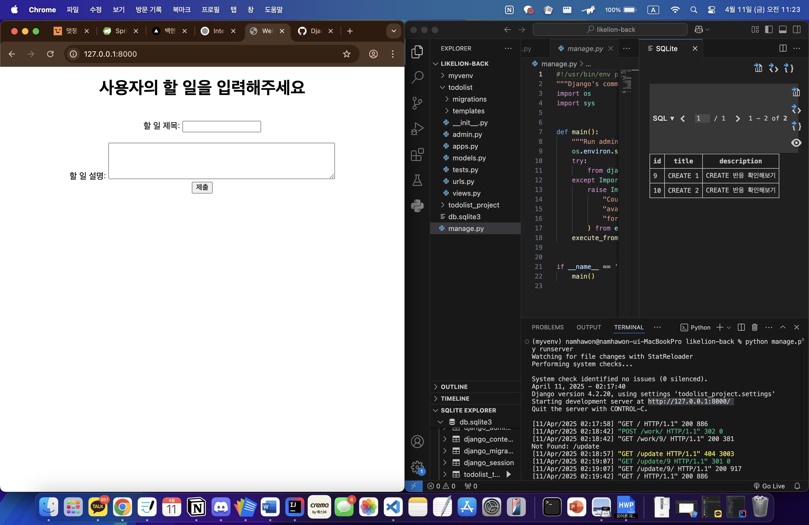
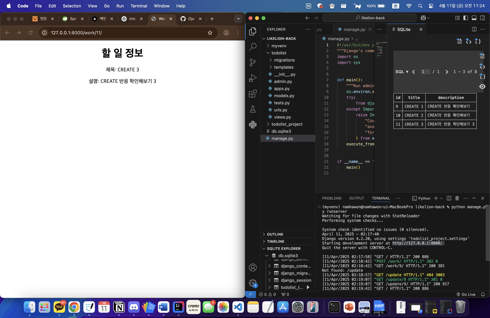
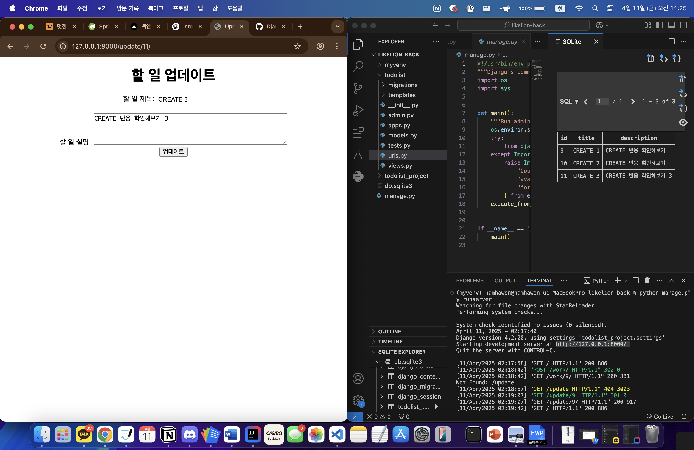
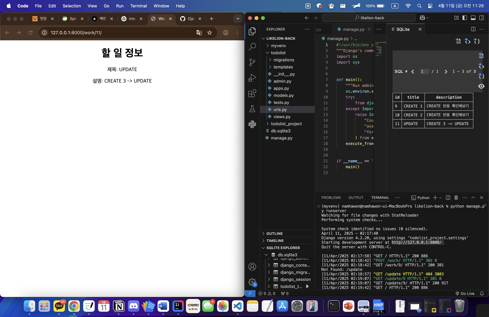

# CRUD 실습 결과

아래는 CRUD(Create, Read, Update, Delete) 기능 구현에 따른 화면 변화 결과입니다.

---

## 📌 Create (생성)

| 생성 전 | 생성 후 |
|---------|----------|
|  |  |

---

## ✏️ Update (수정)

| 수정 전 | 수정 후 |
|---------|----------|
|  |  |

---

## 🗑️ Delete (삭제)

| 삭제 전 | 삭제 후 |
|---------|----------|
|  |  |
